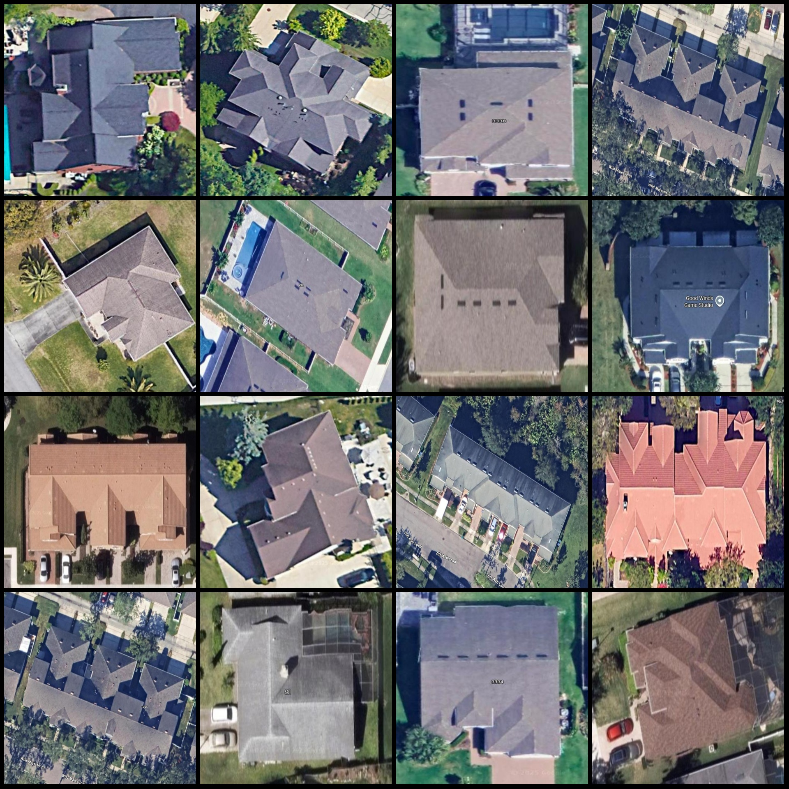
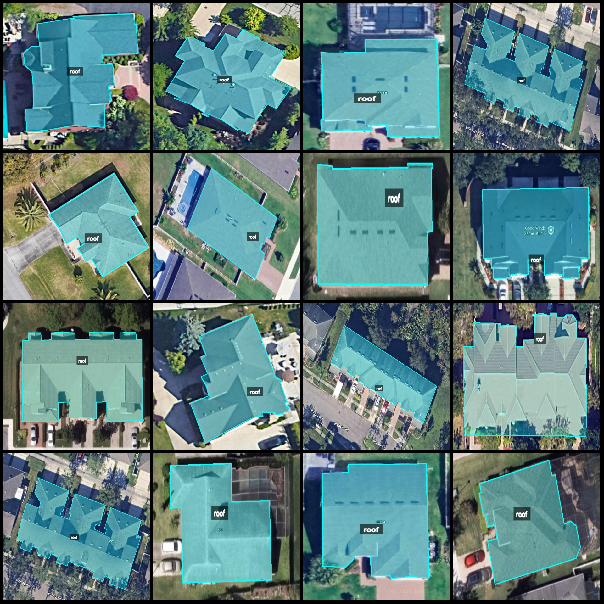
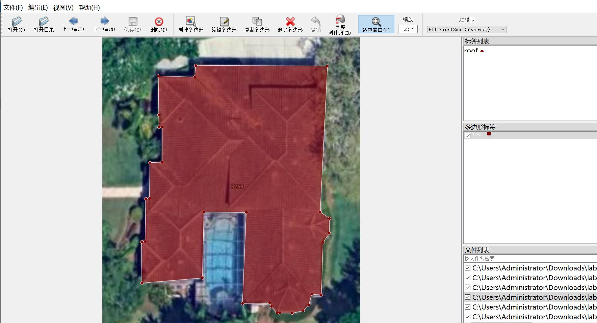

# Drone Perspective Roof Identification and Segmentation Dataset - labeledme format with 1650 images in one class

Dataset format: labeledme format (excluding mask files, only including jpg images and corresponding json files).
Number of images (number of jpg files): 1650
Number of annotations (json file count): 1650
Number of annotation categories: 1
Annotation category name: "roof"
Number of boxes per category: 1781
Total number of boxes: 1781
Annotation tool used: labeledme version 5.5.0
Image resolutions: Multiple resolution images, such as 914x849, 577x508, etc.
Annotation rules: Polygon box drawing for the category
Important note: The dataset can be edited using labeledme, but the json dataset needs to be converted into mask or yolo format or coco format for semantic segmentation or instance segmentation.
Special declaration: This dataset does not guarantee the accuracy of the trained models or weight files.
Preview of images:
Annotation example:
Labeled drawing result:
Labeledme editing image example:

## Images

Here is a pay link on Stripe ( https://buy.stripe.com/3cs8yP7sY87d0vu9AB ). Please contact me lonlonago@foxmail.com after funding $89, and I will send you a complete data files , thank you!

